# Byzantine decisions dependency graph

- Source: `d:/Steam/steamapps/common/For The Glory/Mods/Gloriana_1337/Db/Decisions/Byzantine.txt`
- Decisions parsed: **37**
- Internal flags (set inside decisions): **25**
- External flags (referenced only): **2**
- Requirement edges: **100**
- Blocking edges: **64**

```mermaid
flowchart TD
  D6000["6000 Restoration of Asia Minor"]
  D6001["6001 Restoration of the Balkans"]
  D6002["6002 Restoration of the East and West"]
  D6003["6003 Restoration of Asia Minor"]
  D6004["6004 Restoration of Southern Italy"]
  D6005["6005 General Restoration"]
  D6006["6006 Restoration of the Balkans"]
  D6007["6007 Restoration of the Holy Land"]
  D6008["6008 Restoration of the East and West"]
  D6009["6009 Restoration of Asia Minor"]
  D6010["6010 Restoration of the Holy Land"]
  D6011["6011 Restoration of Southern Italy"]
  D6012["6012 Restoration of the Balkans"]
  D6013["6013 Restoration of the Holy Land"]
  D6014["6014 Restoration of Southern Italy"]
  D6015["6015 Restoration of North Africa"]
  D6020["6020 A Crossroads: To the East!"]
  D6021["6021 A Crossroads: Westward Ho!"]
  D6022["6022 A Crossroads: Keep the Options Open"]
  D6023["6023 A Crossroads: We are but a Rigas"]
  D6024["6024 Victory in the Balkans: To the East!"]
  D6025["6025 Victory in the Balkans: We march on Rome!"]
  D6026["6026 Victory in the Balkans: Keep Options Open"]
  D6027["6027 Victory in Anatolia: We oughtn't leave a knife at our back"]
  D6028["6028 Victory in Anatolia: Next year in Jerusalem!"]
  D6029["6029 Victory in Anatolia: I can never choose"]
  D6030["6030 Victory in Italy: To the East!"]
  D6031["6031 The Empire of Basil II: Let us put away our childish things"]
  D6032["6032 The Empire of Basil II: Next year in Jerusalem!"]
  D6033["6033 The Empire of Basil II: We march on Rome!"]
  D6034["6034 Victory in Egypt: Unfinished business"]
  D6035["6035 Conquest of Egypt: In His name, to His glory"]
  D6036["6036 The Empire of the East: Consolidate our realm"]
  D6037["6037 The Empire of the East: Mother of God, aid your servant"]
  D6038["6038 Conquest of Africa: This war is unjust"]
  D6039["6039 Conquest of Africa: Reclaim Africa for the Cross"]
  D6040["6040 The Restoration is Complete"]
  F_Romeward{{flag Romeward}}
  F_Romeward2{{flag Romeward2}}
  F_Romeward3{{flag Romeward3}}
  F_byz_basil2{{flag byz_basil2}}
  F_byz_conquest_africa{{flag byz_conquest_africa}}
  F_byz_conquest_egypt{{flag byz_conquest_egypt}}
  F_byz_crossroads{{flag byz_crossroads}}
  F_byz_empire_east{{flag byz_empire_east}}
  F_byz_restoration_complete{{flag byz_restoration_complete}}
  F_byz_victory_anatolia{{flag byz_victory_anatolia}}
  F_byz_victory_balkans{{flag byz_victory_balkans}}
  F_byz_victory_egypt{{flag byz_victory_egypt}}
  F_byz_victory_italy{{flag byz_victory_italy}}
  F_levant{{flag levant}}
  F_levant2{{flag levant2}}
  F_levant3{{flag levant3}}
  F_nthafrica{{flag nthafrica}}
  F_optionsopen{{flag optionsopen}}
  F_optionsopen2{{flag optionsopen2}}
  F_totheeast{{flag totheeast}}
  F_totheeast2{{flag totheeast2}}
  F_totheeast3{{flag totheeast3}}
  F_westwardho{{flag westwardho}}
  F_westwardho2{{flag westwardho2}}
  F_westwardho3{{flag westwardho3}}
  F_byz_restoration_complete_blocked(((ext flag byz_restoration_complete_blocked)))
  F_optionsopen3(((ext flag optionsopen3)))
  D6020 --> F_byz_crossroads
  D6020 --> F_totheeast
  D6021 --> F_byz_crossroads
  D6021 --> F_westwardho
  D6022 --> F_byz_crossroads
  D6022 --> F_optionsopen
  D6023 --> F_byz_crossroads
  D6024 --> F_byz_victory_balkans
  D6024 --> F_totheeast2
  D6025 --> F_Romeward
  D6025 --> F_byz_victory_balkans
  D6026 --> F_byz_victory_balkans
  D6026 --> F_optionsopen2
  D6027 --> F_byz_victory_anatolia
  D6027 --> F_westwardho2
  D6028 --> F_byz_victory_anatolia
  D6028 --> F_levant
  D6029 --> F_byz_victory_anatolia
  D6030 --> F_byz_victory_italy
  D6030 --> F_totheeast3
  D6031 --> F_byz_basil2
  D6032 --> F_byz_basil2
  D6032 --> F_levant2
  D6033 --> F_Romeward2
  D6033 --> F_byz_basil2
  D6034 --> F_byz_victory_egypt
  D6034 --> F_westwardho3
  D6035 --> F_byz_conquest_egypt
  D6035 --> F_levant3
  D6036 --> F_byz_empire_east
  D6037 --> F_Romeward3
  D6037 --> F_byz_empire_east
  D6038 --> F_byz_conquest_africa
  D6039 --> F_byz_conquest_africa
  D6039 --> F_nthafrica
  D6040 --> F_byz_restoration_complete
  D6020 -->|requires totheeast| D6000
  D6020 -->|requires byz_crossroads| D6024
  D6020 -->|requires byz_crossroads| D6025
  D6020 -->|requires byz_crossroads| D6026
  D6020 -->|requires byz_crossroads| D6027
  D6020 -->|requires byz_crossroads| D6028
  D6020 -->|requires byz_crossroads| D6029
  D6020 -->|requires byz_crossroads| D6031
  D6020 -->|requires byz_crossroads| D6032
  D6020 -->|requires byz_crossroads| D6033
  D6020 -->|requires byz_crossroads| D6034
  D6020 -->|requires byz_crossroads| D6035
  D6020 -->|requires byz_crossroads| D6036
  D6020 -->|requires byz_crossroads| D6037
  D6020 -->|requires byz_crossroads| D6038
  D6020 -->|requires byz_crossroads| D6039
  D6020 -->|requires byz_crossroads| D6040
  D6021 -->|requires westwardho| D6001
  D6021 -->|requires byz_crossroads| D6024
  D6021 -->|requires byz_crossroads| D6025
  D6021 -->|requires byz_crossroads| D6026
  D6021 -->|requires byz_crossroads| D6027
  D6021 -->|requires byz_crossroads| D6028
  D6021 -->|requires byz_crossroads| D6029
  D6021 -->|requires byz_crossroads| D6031
  D6021 -->|requires byz_crossroads| D6032
  D6021 -->|requires byz_crossroads| D6033
  D6021 -->|requires byz_crossroads| D6034
  D6021 -->|requires byz_crossroads| D6035
  D6021 -->|requires byz_crossroads| D6036
  D6021 -->|requires byz_crossroads| D6037
  D6021 -->|requires byz_crossroads| D6038
  D6021 -->|requires byz_crossroads| D6039
  D6021 -->|requires byz_crossroads| D6040
  D6022 -->|requires optionsopen| D6002
  D6022 -->|requires byz_crossroads| D6024
  D6022 -->|requires byz_crossroads| D6025
  D6022 -->|requires byz_crossroads| D6026
  D6022 -->|requires byz_crossroads| D6027
  D6022 -->|requires byz_crossroads| D6028
  D6022 -->|requires byz_crossroads| D6029
  D6022 -->|requires byz_crossroads| D6031
  D6022 -->|requires byz_crossroads| D6032
  D6022 -->|requires byz_crossroads| D6033
  D6022 -->|requires byz_crossroads| D6034
  D6022 -->|requires byz_crossroads| D6035
  D6022 -->|requires byz_crossroads| D6036
  D6022 -->|requires byz_crossroads| D6037
  D6022 -->|requires byz_crossroads| D6038
  D6022 -->|requires byz_crossroads| D6039
  D6022 -->|requires byz_crossroads| D6040
  D6023 -->|requires byz_crossroads| D6024
  D6023 -->|requires byz_crossroads| D6025
  D6023 -->|requires byz_crossroads| D6026
  D6023 -->|requires byz_crossroads| D6027
  D6023 -->|requires byz_crossroads| D6028
  D6023 -->|requires byz_crossroads| D6029
  D6023 -->|requires byz_crossroads| D6031
  D6023 -->|requires byz_crossroads| D6032
  D6023 -->|requires byz_crossroads| D6033
  D6023 -->|requires byz_crossroads| D6034
  D6023 -->|requires byz_crossroads| D6035
  D6023 -->|requires byz_crossroads| D6036
  D6023 -->|requires byz_crossroads| D6037
  D6023 -->|requires byz_crossroads| D6038
  D6023 -->|requires byz_crossroads| D6039
  D6023 -->|requires byz_crossroads| D6040
  D6024 -->|requires totheeast2| D6003
  D6024 -->|requires byz_victory_balkans| D6030
  D6024 -->|requires byz_victory_balkans| D6031
  D6024 -->|requires byz_victory_balkans| D6032
  D6024 -->|requires byz_victory_balkans| D6033
  D6025 -->|requires Romeward| D6004
  D6025 -->|requires byz_victory_balkans| D6030
  D6025 -->|requires byz_victory_balkans| D6031
  D6025 -->|requires byz_victory_balkans| D6032
  D6025 -->|requires byz_victory_balkans| D6033
  D6026 -->|requires optionsopen2| D6005
  D6026 -->|requires byz_victory_balkans| D6030
  D6026 -->|requires byz_victory_balkans| D6031
  D6026 -->|requires byz_victory_balkans| D6032
  D6026 -->|requires byz_victory_balkans| D6033
  D6027 -->|requires westwardho2| D6006
  D6027 -->|requires byz_victory_anatolia| D6031
  D6027 -->|requires byz_victory_anatolia| D6032
  D6027 -->|requires byz_victory_anatolia| D6033
  D6028 -->|requires levant| D6007
  D6028 -->|requires byz_victory_anatolia| D6031
  D6028 -->|requires byz_victory_anatolia| D6032
  D6028 -->|requires byz_victory_anatolia| D6033
  D6029 -->|requires byz_victory_anatolia| D6031
  D6029 -->|requires byz_victory_anatolia| D6032
  D6029 -->|requires byz_victory_anatolia| D6033
  D6030 -->|requires totheeast3| D6009
  D6032 -->|requires levant2| D6010
  D6033 -->|requires Romeward2| D6011
  D6034 -->|requires westwardho3| D6012
  D6035 -->|requires levant3| D6013
  D6037 -->|requires Romeward3| D6014
  D6039 -->|requires nthafrica| D6015
  F_optionsopen3 -->|requires| D6008
  D6020 -. blocks byz_crossroads .-> D6021
  D6020 -. blocks byz_crossroads .-> D6022
  D6020 -. blocks byz_crossroads .-> D6023
  D6021 -. blocks byz_crossroads .-> D6020
  D6021 -. blocks byz_crossroads .-> D6022
  D6021 -. blocks byz_crossroads .-> D6023
  D6022 -. blocks byz_crossroads .-> D6020
  D6022 -. blocks byz_crossroads .-> D6021
  D6022 -. blocks byz_crossroads .-> D6023
  D6023 -. blocks byz_crossroads .-> D6020
  D6023 -. blocks byz_crossroads .-> D6021
  D6023 -. blocks byz_crossroads .-> D6022
  D6024 -. blocks byz_victory_balkans .-> D6025
  D6024 -. blocks byz_victory_balkans .-> D6026
  D6024 -. blocks byz_victory_balkans .-> D6027
  D6024 -. blocks byz_victory_balkans .-> D6028
  D6024 -. blocks byz_victory_balkans .-> D6029
  D6024 -. blocks byz_victory_balkans .-> D6034
  D6025 -. blocks byz_victory_balkans .-> D6024
  D6025 -. blocks byz_victory_balkans .-> D6026
  D6025 -. blocks byz_victory_balkans .-> D6027
  D6025 -. blocks byz_victory_balkans .-> D6028
  D6025 -. blocks byz_victory_balkans .-> D6029
  D6025 -. blocks byz_victory_balkans .-> D6034
  D6026 -. blocks byz_victory_balkans .-> D6024
  D6026 -. blocks byz_victory_balkans .-> D6025
  D6026 -. blocks byz_victory_balkans .-> D6027
  D6026 -. blocks byz_victory_balkans .-> D6028
  D6026 -. blocks byz_victory_balkans .-> D6029
  D6026 -. blocks byz_victory_balkans .-> D6034
  D6027 -. blocks byz_victory_anatolia .-> D6024
  D6027 -. blocks byz_victory_anatolia .-> D6025
  D6027 -. blocks byz_victory_anatolia .-> D6026
  D6027 -. blocks byz_victory_anatolia .-> D6028
  D6027 -. blocks byz_victory_anatolia .-> D6029
  D6027 -. blocks byz_victory_anatolia .-> D6030
  D6028 -. blocks byz_victory_anatolia .-> D6024
  D6028 -. blocks byz_victory_anatolia .-> D6025
  D6028 -. blocks byz_victory_anatolia .-> D6026
  D6028 -. blocks byz_victory_anatolia .-> D6027
  D6028 -. blocks byz_victory_anatolia .-> D6029
  D6028 -. blocks byz_victory_anatolia .-> D6030
  D6029 -. blocks byz_victory_anatolia .-> D6024
  D6029 -. blocks byz_victory_anatolia .-> D6025
  D6029 -. blocks byz_victory_anatolia .-> D6026
  D6029 -. blocks byz_victory_anatolia .-> D6027
  D6029 -. blocks byz_victory_anatolia .-> D6028
  D6029 -. blocks byz_victory_anatolia .-> D6030
  D6030 -. blocks byz_victory_italy .-> D6031
  D6030 -. blocks byz_victory_italy .-> D6032
  D6030 -. blocks byz_victory_italy .-> D6033
  D6031 -. blocks byz_basil2 .-> D6030
  D6031 -. blocks byz_basil2 .-> D6032
  D6031 -. blocks byz_basil2 .-> D6033
  D6032 -. blocks byz_basil2 .-> D6030
  D6032 -. blocks byz_basil2 .-> D6031
  D6032 -. blocks byz_basil2 .-> D6033
  D6033 -. blocks byz_basil2 .-> D6030
  D6033 -. blocks byz_basil2 .-> D6031
  D6033 -. blocks byz_basil2 .-> D6032
  D6036 -. blocks byz_empire_east .-> D6037
  D6037 -. blocks byz_empire_east .-> D6036
  D6038 -. blocks byz_conquest_africa .-> D6039
  D6039 -. blocks byz_conquest_africa .-> D6038
  F_byz_restoration_complete_blocked -. blocks .-> D6040
```

`

## External flags

- `byz_restoration_complete_blocked` -> decisions: 6040
- `optionsopen3` -> decisions: 6008
